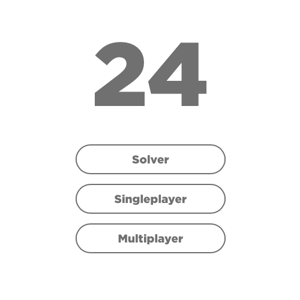
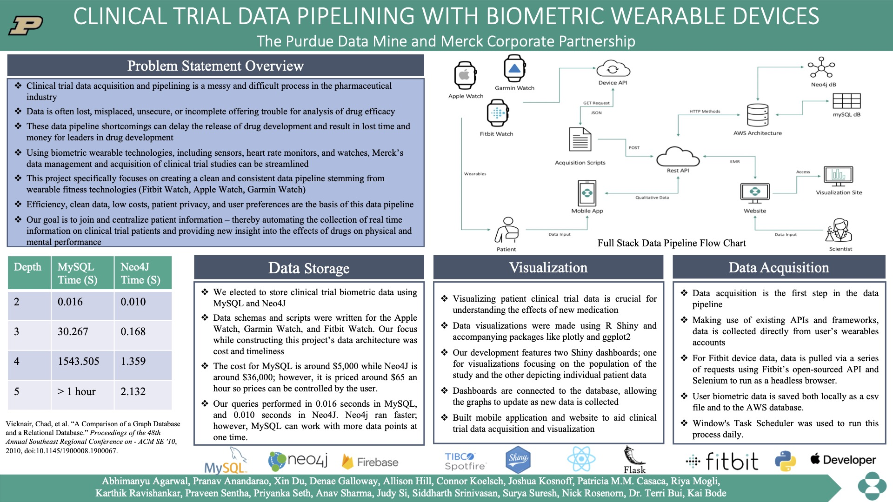
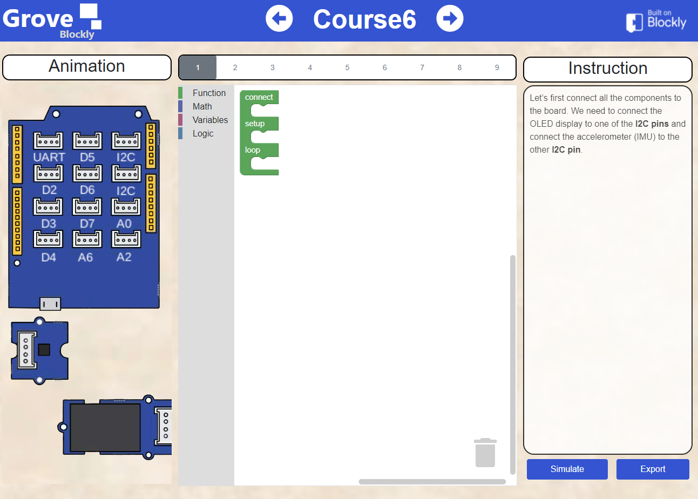
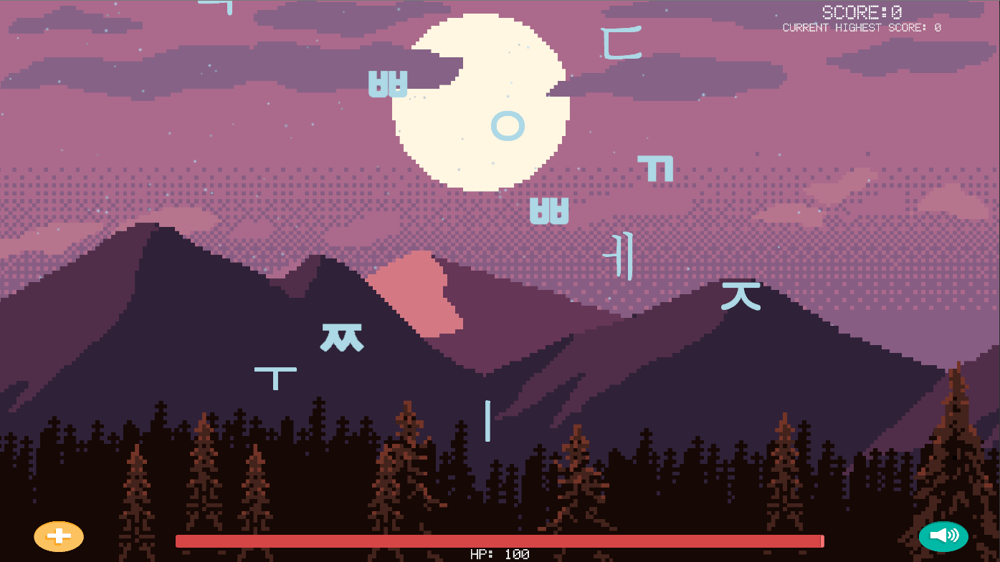



## The 24 Game
 
[Website](https://www.24game.app/) for solving the 24 game and playing it online with friends. 

## Merck Biometrics Software Pipeline
 
Software pipeline built for Merck for evaluating the effect on mental and physical performance during the clinical trial phase of a new drug lifecycle. Final poster and presentation can be found [here](https://datamine.purdue.edu/symposium/merck/2021.html).

## Digicraft Blockly
 
[Digicraft Blockly](https://digicraft-blockly.herokuapp.com/) is a website that has been used by Purdue's C-Design Lab to help hundreds of middle/high school students learn Arduino microcontroller programming.

## Korean Keyboard Practice Game
 
An unity game teaches players how to type Korean characters on keyboard in a fun way. The game can be downloaded from Microsoft Store by searching "Korean Keyboard Practice".

